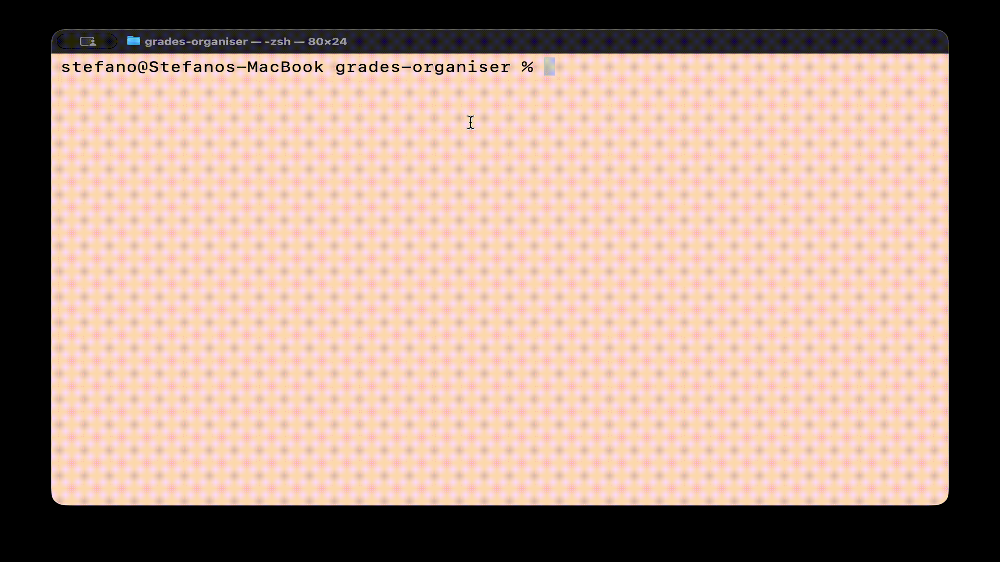

<h1 align = "center" style = "margin-bottom: 0;">
    <br>
    📘 Grades Organiser
</h1>

<p align="center" style="margin-top: 0"> 
A simple command-line tool to help you keep track of your university grades, calculate averages and manage your study modules easily.
</p>

---

## 📘 Features

- Add and remove grades for modules
- Show all saved grades
- Calculate weighted average based on ECTS credits

<a style="text-align: center; margin-top: 0;">
  
</a>

---

## ✏️ Get started

### Prerequisites

- [GHC (Glasgow Haskell Compiler)](https://www.haskell.org/ghc/) (version 8.0 or later recommended)
- [Cabal](https://www.haskell.org/cabal/) build tool (version 3.0 or later)

### Clone the repository

```bash
git clone https://github.com/Slydetx/grades-organiser.git
cd grades-organiser
```
### Run program

```bash
cabal build
cabal run
```

>[!NOTE]
>This program does not use a database to store data. Instead, it saves everything in a text file named grades.txt in the project folder.
>If you delete this file, all your data will be lost.